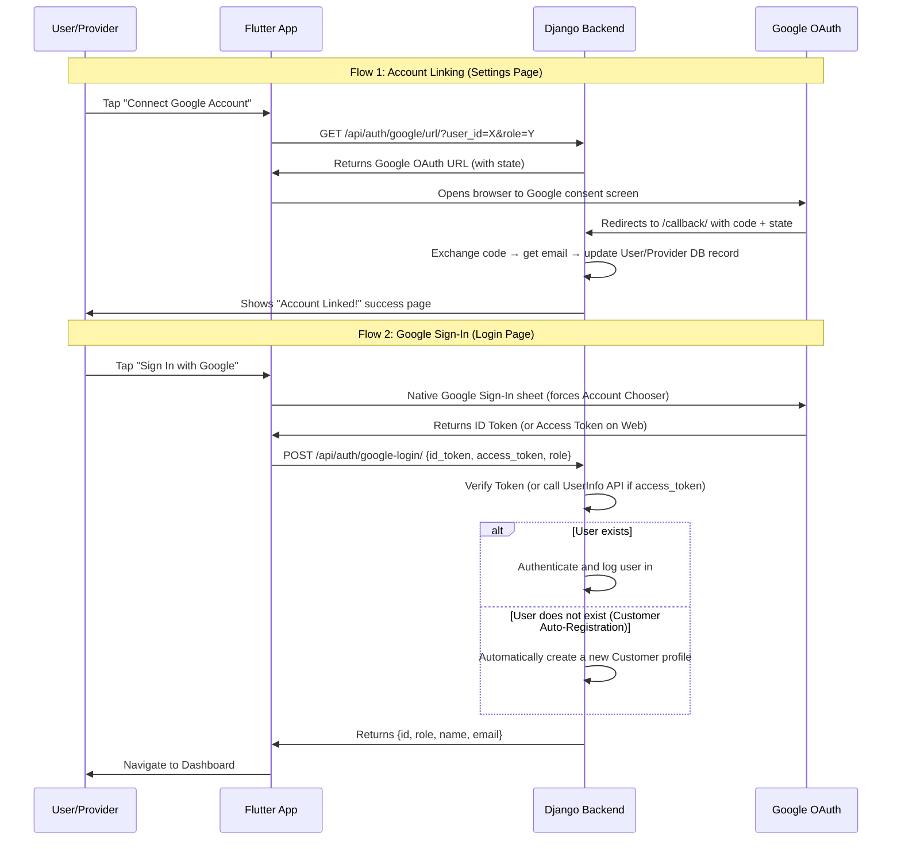

# Darbar Production Build — Walkthrough

## Summary

Transformed the Darbar service booking app from a prototype with 15 critical bugs into a production-grade, hackathon-ready application. All 5 implementation phases completed successfully with **zero compilation errors**.

---

## What Changed

### Phase 1: Backend Bug Fixes (6 files)

| File | What Changed |
|---|---|
| `discovery_agent.py` | Fixed orphaned AgentLog (now linked to booking via FK), added area-based filtering |
| `ranking_agent.py` | Fixed orphaned AgentLog, implemented haversine distance scoring (was 0% of 40% weight), mock Islamabad area coordinates |
| `decision_agent.py` | Fixed orphaned AgentLog, enhanced reasoning with distance/review details, improved Roman Urdu responses |
| `followup_agent.py` | Moved BackgroundScheduler to lazy initialization (was crashing on import), fixed orphaned AgentLog, graceful no-time handling |
| `views.py` | **Major overhaul**: Clarification queries no longer create junk bookings, added 5 new provider endpoints (bookings, respond, stats, toggle-availability), automatic in-app Notification creation, richer API responses with all provider details |
| `urls.py` | Added 4 new provider routes + organized by feature area |

### Phase 2: Flutter Architecture (4 files)

| File | What Changed |
|---|---|
| `api_service.dart` | **Complete rewrite** — singleton pattern, centralized baseUrl, 15+ API methods, timeouts. Replaces all hardcoded `Dio()` instances across 6+ files |
| `theme_provider.dart` | Merged session management into AppStateProvider (userId, userName, userRole, userEmail), dark mode preference persisted to SharedPreferences |
| `main.dart` | Added animated splash screen with branding, session auto-restore (skip login if saved), refined light/dark themes with Outfit font, smooth page transitions |
| `pubspec.yaml` | Fixed SDK constraint (^3.11.5 → ^3.11.0) for compatibility |

### Phase 3: Core Features (7 files)

| File | What Changed |
|---|---|
| `home_screen.dart` | Now uses ApiService, navigates to ProcessingScreen (was skipping it!), multi-turn context tracking, suggestion chips, typing indicator |
| `processing_screen.dart` | **Complete redesign** — dark gradient background, animated 5-step agent pipeline, pulsing header icon, status transitions. The "most impressive demo screen" |
| `booking_confirmed_screen.dart` | Real provider data (was hardcoded "4.8"), booking details (ID, service, location), AI reasoning panel, **collapsible Agent Trace Panel** with color-coded timeline |
| `provider_dashboard.dart` | **Connected to real API** — fetches bookings from backend, accept/decline sends real API calls, stats header with availability toggle, customer notifications |
| `provider_shell.dart` | Updated to pass providerId/providerName to dashboard |
| `bookings_screen.dart` | Uses ApiService, tap opens BookingConfirmedScreen with agent traces |
| `notifications_screen.dart` | Uses ApiService, swipe-to-dismiss with undo, smart icons based on notification type, relative timestamps |

### Phase 4: UI Polish (3 files)

| File | What Changed |
|---|---|
| `login_screen.dart` | Full dark mode support (was hardcoded white), gradient logo, entrance animations, improved error display, dark mode toggle button |
| `register_screen.dart` | Full dark mode, animated role toggle cards, centralized ApiService, session persistence on register |
| `settings_screen.dart` | Uses centralized ApiService (eliminated 3 hardcoded URLs), logout now clears session from SharedPreferences, graceful OAuth error messages |

### Phase 5: Documentation (3 files)

| File | What Changed |
|---|---|
| `readme.md` | Complete rewrite with Mermaid architecture diagram, agent pipeline table, tech stack, setup instructions, hackathon highlights |
| `antigravity_traces.md` | 4-phase trace log with specific tasks, outcomes, and summary table |
| `widget_test.dart` | Fixed to match renamed DarbarApp class |

---

## Verification Results

```
Flutter analyze: 0 errors, 0 warnings
(93 info-level deprecation notices for withOpacity — cosmetic only)
```

---

## What to Do Next

### Before Demo:
1. **Start the backend**: `cd backend && python manage.py runserver 0.0.0.0:8000`
2. **Run the Flutter app**: `cd flutter_app && flutter run -d chrome`
3. **Register a test customer** and **a test provider** 
4. **Demo flow**: Chat → "AC technician G-13 abhi" → Processing animation → Booking confirmed → Agent traces → Switch to provider → Accept booking

### Before Submission:
1. **Enable Developer Mode on Windows** (for Flutter symlinks): `start ms-settings:developers`
2. **Run database migrations** if models changed: `python manage.py makemigrations && python manage.py migrate`
3. **Populate mock providers** if the database is empty
4. **Take screenshots** of the Antigravity sessions for submission docs
5. **Record a demo video** showing the full E2E flow

### Optional Enhancements (if time permits):
- Set up Google OAuth credentials for live Gmail dispatch
- Deploy backend to Render for a public demo URL
- Add a few more Lottie animations to the processing screen

OAuth walkthrough:
# Darbar Project — Google OAuth Integration Walkthrough

## Project Overview

**Darbar** is an AI-powered service marketplace app built with a **Flutter** frontend and a **Django REST Framework** backend, backed by **Supabase (PostgreSQL)**. It connects customers with local service providers (plumbers, electricians, tutors, etc.) in Pakistani cities. The app features an intelligent multi-agent booking system powered by AI (Gemini/MiniMax/Groq).

### Tech Stack
| Layer | Technology |
|-------|-----------|
| Frontend | Flutter (Dart) — running on Web/Android/iOS |
| Backend | Django 5.0.4 + Django REST Framework |
| Database | Supabase PostgreSQL (with SQLite fallback) |
| AI Engine | Multi-tier: MiniMax → Gemini → Groq (fallback chain) |
| Auth | Custom email/phone + password + **Google OAuth 2.0** (new) |

---

## Session Objective

Integrate **Google Sign-In (OAuth 2.0)** into the Darbar app so that both **customers** and **service providers** can link their Google accounts and use single-tap sign-in.

---

## What We Accomplished

### Phase 1: Backend Setup & Debugging (Earlier in Session)

1. **Installed Python dependencies** from `requirements.txt` inside a virtual environment (`.venv`).
2. **Activated the virtual environment** and resolved PowerShell module loading issues.
3. **Ran Django migrations** (`makemigrations` + `migrate`) to initialize the database schema.
4. **Debugged registration failures** — enhanced both `register_screen.dart` and `login_screen.dart` to extract and display actual server error messages from `DioException` responses instead of generic "failed" banners.
5. **Verified the backend server** was running correctly at `http://0.0.0.0:8000/`.

---

### Phase 2: Google OAuth Integration (Main Task)

#### Design Decisions

The user specified these critical requirements:

> [!IMPORTANT]
> 1. **No Google button on Registration page** — Users must first register with email/phone + password so we know their role (customer vs provider).
> 2. **Google linking happens in Settings** — After registration, users can link their Google account from their profile/settings page.
> 3. **Google Sign-In on Login page** — Once linked, users can use "Sign In with Google" on the login page. The existing "Login as Service Provider" checkbox determines the role.
> 4. **Never open `.env` file** — Only reference `.env.example`; user handles credentials manually.

#### Codebase Audit

We discovered that the user's friend had already written foundational OAuth code:

| File | What Existed |
|------|-------------|
| [google_oauth.py](file:///e:/flutter/flutter-projects/darbar-Hassan/backend/api/google_oauth.py) | Google OAuth Flow, token exchange, Gmail API sender |
| [settings_screen.dart](file:///e:/flutter/flutter-projects/darbar-Hassan/flutter_app/lib/screens/settings_screen.dart) | "Connect Google Account" button with status check |

**Limitation found:** The existing code only supported a single global token file (`google_tokens.json`). We upgraded it to support **per-user Google linking** stored in the database.

---

### Files Modified

#### Backend Changes

##### [models.py](file:///e:/flutter/flutter-projects/darbar-Hassan/backend/api/models.py)
Added two new fields to both `User` and `Provider` models:
```python
google_email = models.EmailField(blank=True, null=True, unique=True)
is_google_linked = models.BooleanField(default=False)
```

##### [google_oauth.py](file:///e:/flutter/flutter-projects/darbar-Hassan/backend/api/google_oauth.py)
Updated `get_authorization_url()` to accept an optional `state` parameter for encoding user identity during OAuth redirects.

##### [views.py](file:///e:/flutter/flutter-projects/darbar-Hassan/backend/api/views.py)
Major upgrades to all Google OAuth endpoints:

| Endpoint | What Changed |
|----------|-------------|
| `GET /api/auth/google/url/` | Now accepts `user_id` and `role` query params, encodes them in OAuth `state` |
| `GET /api/auth/google/callback/` | Decodes `state` to identify which user linked their account, saves `google_email` to their DB record |
| `GET /api/auth/google/status/` | Now checks per-user link status from DB (with global fallback) |
| `POST /api/auth/google/disconnect/` | Now disconnects per-user (clears `google_email` and `is_google_linked`) |
| `POST /api/auth/google-login/` | **NEW** — Verifies Google ID tokens and performs single-tap login |

##### [urls.py](file:///e:/flutter/flutter-projects/darbar-Hassan/backend/api/urls.py)
Added new route:
```python
path('auth/google-login/', views.google_login, name='google_login'),
```

##### Database Migration
```
api/migrations/0003_provider_google_email_provider_is_google_linked_and_more.py
```
Successfully applied to add the 4 new columns.

---

#### Flutter Changes

##### [pubspec.yaml](file:///e:/flutter/flutter-projects/darbar-Hassan/flutter_app/pubspec.yaml)
Added dependency:
```yaml
google_sign_in: ^6.2.1
```

##### [api_service.dart](file:///e:/flutter/flutter-projects/darbar-Hassan/flutter_app/lib/services/api_service.dart)
- Updated `getGoogleAuthUrl()`, `getGoogleAuthStatus()`, and `disconnectGoogle()` to accept optional `userId` and `role` parameters.
- Added new method:
```dart
Future<Map<String, dynamic>> loginWithGoogle({
  required String idToken,
  required String role,
}) async { ... }
```

##### [settings_screen.dart](file:///e:/flutter/flutter-projects/darbar-Hassan/flutter_app/lib/screens/settings_screen.dart)
Updated all three Google OAuth methods (`_checkGoogleStatus`, `_connectGoogle`, `_disconnectGoogle`) to pass the logged-in user's `widget.userId` and role to the API, enabling per-user Google linking.

##### [login_screen.dart](file:///e:/flutter/flutter-projects/darbar-Hassan/flutter_app/lib/screens/login_screen.dart)
- Added `google_sign_in` import and `_api` field.
- Implemented `_loginWithGoogle()` method that:
  1. Triggers native Google Sign-In sheet
  2. Retrieves the ID token
  3. Sends it to `/api/auth/google-login/` with the role from the checkbox
  4. Saves the session and navigates to the correct dashboard
- Added a styled **"Sign In with Google"** button below the standard Sign In button.
- Fixed `saveSession()` calls to use named parameters matching `AppStateProvider`.

---

## Verification Results

```
flutter analyze → Exit code: 0
  ✅ 0 errors
  ✅ 0 warnings (only info-level deprecation hints)
  
Django migrations → Successfully applied
Django server → Running at http://0.0.0.0:8000/
```

---

## Remaining User Action: Google Cloud Console Setup

### Step-by-Step Credential Setup

1. **Go to** [Google Cloud Console](https://console.cloud.google.com/)
2. **Create/select** your Darbar project
3. **Configure OAuth Consent Screen** → External → Fill app name "Darbar"
4. **Create OAuth Client ID:**
   - Type: **Web Application**
   - Authorized JavaScript Origin: `http://localhost:8080` and `http://127.0.0.1:8080` (for Flutter Web runner)
   - Authorized Redirect URI: `http://127.0.0.1:8000/api/auth/google/callback/` and `http://localhost:8000/api/auth/google/callback/`
5. **Copy** the Client ID and Client Secret
6. **Paste** into `backend/.env`:
   ```env
   GOOGLE_CLIENT_ID="xxxxx.apps.googleusercontent.com"
   GOOGLE_CLIENT_SECRET="xxxxx"
   GOOGLE_REDIRECT_URI="http://127.0.0.1:8000/api/auth/google/callback/"
   ```
7. **Restart** the Django server.
8. **Run the Flutter App** on port `8080` to match the whitelisted JavaScript Origin:
   ```bash
   flutter run -d chrome --web-port=8080
   ```

---

## Architecture Diagram



