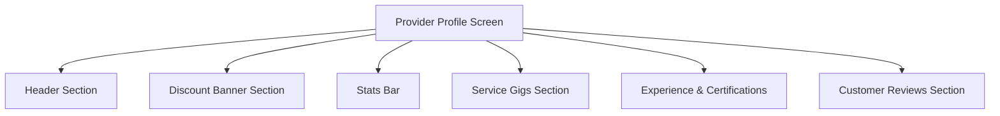

# 🧑‍🔧 Service Provider Profile — Feature & Layout Walkthrough

This document outlines the architecture, interactive features, and recent user experience (UX) enhancements implemented on the **Service Provider Profile** screen (`provider_profile_screen.dart`).

---

## 📱 Architecture & Sections

The Service Provider Profile is divided into six logical sections built to present the provider's business details clearly to both customers and administrators, and to allow intuitive self-management for the logged-in provider:

### 1. Header Section
- Displays the **Business Name**, **Category Badge** (e.g. *Air Conditioning*, *Plumbing*), and **Location** (Area, City).
- Displays the **Profile Avatar** (circular frame with a fallback default icon if no image is uploaded).
- When in Edit Mode, the avatar shows a camera icon overlay allowing the provider to pick and upload a new profile photo.

### 2. Discount Banner Section (Promotions)
- A prominent orange gradient card (`Colors.orange.shade600` to `Colors.orange.shade400`) highlighting active promotional offers.
- Automatically hides if there are no active discounts.
- Logged-in providers can edit or create discount banners (specifying promo message and percentage discount) via a custom modal dialog.

### 3. Stats Bar
- Displays key performance indicators:
  - **Rating** (average stars, e.g. `4.8 ⭐`).
  - **Review Count** (total reviews received).
  - **Years of Experience** (total years active in business).

### 4. Service Gigs Section
- Shows a horizontal list of individual services (gigs) offered by the provider.
- Each gig shows:
  - Cover image.
  - Title.
  - Price range (e.g., `PKR 1,500 - PKR 3,000`).
  - Estimated completion time.
- Tap to open a detailed **Gig Details** modal.
- Logged-in providers in edit mode can:
  - **Add a new gig** (up to a limit of 6 total gigs) using `EditGigScreen`.
  - **Edit an existing gig**'s pricing, title, description, or image.
  - **Delete a gig** with a confirmation dialog.

### 5. Experience & Certifications
- Shows the provider's credentials, biography description, and years of experience.
- Displays uploaded credential/certificate images.
- In Edit Mode, provides options to upload new certificate photos from the gallery.

### 6. Customer Reviews Section
- Displays list cards of customer reviews showing customer name, star rating, and review comments.
- Provides a "See All" bottom sheet trigger when there are more than three reviews.

---

## 🛠️ Interactive Actions

### Image Upload Flow
The profile handles local image picking and asynchronous upload using the `ImagePicker` and `ApiService`:
1. Tap camera or upload button → Triggers native image picker (`ImageSource.gallery`).
2. Image bytes are read and passed to `_api.uploadImage`.
3. The returned image URL is stored in the local profile state.
4. Changes are committed to the backend DB when the user taps **Save Profile Changes**.

### Gigs Management
- Gigs are constrained to a maximum of 6 to prevent server load and layout clutter.
- Edit/Delete actions are secured so they are only visible and performable when `widget.isEditable` is true.

---

## 🚀 Recent UI & UX Upgrades

Several upgrades were introduced to ensure the profile looks premium and works correctly on web browsers, tablets, and mobile devices:

1. **Web-Friendly Width Constraints**:
   - Wrapped the profile body in a `ConstrainedBox` with a `maxWidth` of `850px` centered on the screen. This prevents elements from stretching awkwardly across ultra-wide desktop monitors.
2. **Dialog to Overlay Conversion**:
   - Replaced standard unconstrained dialogs for gig details with a custom, scrollable `Dialog` containing a `ConstrainedBox` limited to `70%` of screen height. This ensures descriptions and images do not overflow the bottom edge of smaller phone screens.
3. **Graceful Asset Loading & Fallbacks**:
   - Added loading indicators and custom error builders (`Icons.broken_image`) for all network-fetched images (profile photo, certificate image, gig images) to prevent empty grey borders.
