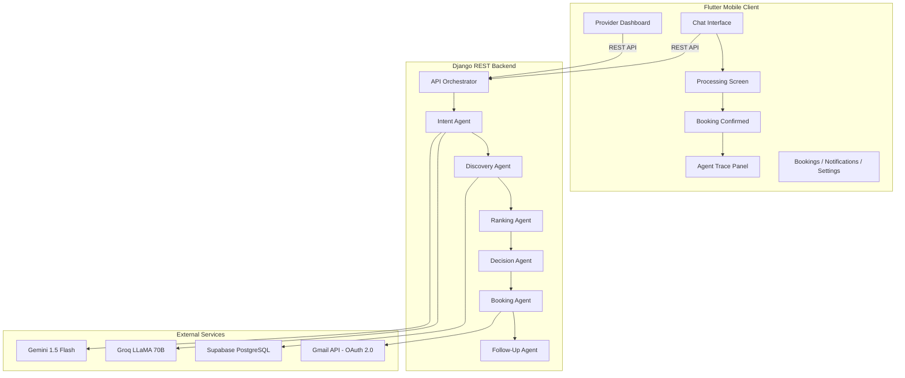

# 🏛️ Darbar — AI-Powered Service Finder

> **An industry-grade, multi-agent AI service booking platform for Pakistan's informal economy.**  
> Built for the **Google AI Seekho 2026 — Antigravity Hackathon**

---

## 🎯 Problem Statement

Finding reliable service providers (electricians, plumbers, AC technicians) in Pakistan is fragmented and trust-deficient. There is no centralized, AI-powered system to match users with verified providers based on proximity, ratings, and availability — especially one that understands **Roman Urdu** and local context.

## 💡 Solution

**Darbar** is a full-stack agentic AI platform that:
- Understands service requests in **English, Urdu, and Roman Urdu**
- Runs a **6-agent AI pipeline** to find, rank, and book the best provider
- Provides **transparent AI reasoning** so users and judges can see exactly how decisions are made
- Supports both **Customer** and **Service Provider** dashboards

---

## 🏗️ Architecture



## 🤖 Agent Pipeline

| # | Agent | Purpose | LLM Used |
|---|---|---|---|
| 1 | **Intent Agent** | Parse natural language → structured intent (service, location, time) | Gemini → Groq → Local Fallback |
| 2 | **Discovery Agent** | Find available providers from database | Supabase PostgreSQL |
| 3 | **Ranking Agent** | Score candidates: Distance (40%) + Rating (35%) + Reviews (25%) | Custom Algorithm |
| 4 | **Decision Agent** | Select best provider, generate human-readable reasoning | Multi-language |
| 5 | **Booking Agent** | Create booking, dispatch notifications via Gmail API | Gmail OAuth 2.0 |
| 6 | **Follow-Up Agent** | Schedule reminders, request ratings | APScheduler |

### Three-Tier LLM Fallback Chain
```
Tier 1: Gemini 1.5 Flash (Primary)
    ↓ (on failure)
Tier 2: Groq LLaMA 70B (Secondary)
    ↓ (on failure)
Tier 3: Local Keyword Fallback (Always works)
```

---

## 📱 App Screens

| Screen | Description |
|---|---|
| **Splash** | Animated branding with session auto-restore |
| **Login / Register** | Dark mode support, email+password auth |
| **Agent Chat** | Natural language input with suggestion chips |
| **Processing** | Animated 5-step agent pipeline visualization |
| **Booking Confirmed** | Provider details, AI reasoning, collapsible Agent Trace Log |
| **My Bookings** | Status badges (pending/confirmed/completed/cancelled) |
| **Provider Dashboard** | Incoming requests, accept/decline, stats header |
| **Notifications** | Swipe-to-dismiss, smart icons, relative timestamps |
| **Settings** | Dark mode, Google OAuth, avatar customization |

---

## 🛠️ Tech Stack

| Layer | Technology |
|---|---|
| **Frontend** | Flutter 3.x (Dart), Material 3, Google Fonts |
| **Backend** | Django 5.x, Django REST Framework |
| **Database** | Supabase (PostgreSQL) |
| **AI / LLM** | Google Gemini 1.5 Flash, Groq LLaMA 70B |
| **Auth** | Google OAuth 2.0 (Gmail API), bcrypt passwords |
| **Email** | Gmail API with HTML templates |
| **State** | Provider (ChangeNotifier), SharedPreferences |
| **Networking** | Dio HTTP client (singleton pattern) |
| **Scheduling** | APScheduler (background reminders) |

---

## 🚀 Setup & Run

### Backend
```bash
cd backend
pip install -r requirements.txt
cp .env.example .env  # Fill in your API keys
python manage.py migrate
python manage.py runserver 0.0.0.0:8000
```

### Flutter
```bash
cd flutter_app
flutter pub get
flutter run -d chrome    # For web
flutter run               # For connected device/emulator
```

### Required Environment Variables
```env
GEMINI_API_KEY=...
GROQ_API_KEY=...
DATABASE_URL=postgresql://...
SUPABASE_URL=...
SUPABASE_KEY=...
# Optional:
GOOGLE_CLIENT_ID=...
GOOGLE_CLIENT_SECRET=...
```

---

## 🏆 Hackathon Highlights

- **Multi-agent architecture** with 6 specialized agents
- **Transparent AI reasoning** — collapsible agent trace panel shows every decision
- **Three-tier LLM fallback** — system never fails
- **Roman Urdu support** — "Mujhe AC wala chahiye G-13 mein"
- **Real provider notifications** via Gmail API
- **Production-grade UI** with dark mode, animations, splash screen
- **Built entirely with Google Antigravity** — see [antigravity_traces.md](antigravity_traces.md)

---

## 📄 License

This project was built for the Google AI Seekho 2026 Antigravity Hackathon.

---

*Built with ❤️ using Google Antigravity*
