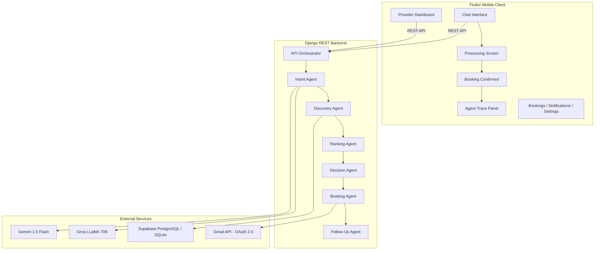

# 🏛️ Darbar — AI-Powered Service Finder

> **An industry-grade, multi-agent AI service booking platform for Pakistan's informal economy.**  
> Built for the **Google AI Seekho 2026 — Antigravity Hackathon**

---

## 🎯 Problem Statement

Finding reliable service providers (electricians, plumbers, AC technicians) in Pakistan is fragmented and trust-deficient. There is no centralized, AI-powered system to match users with verified providers based on proximity, ratings, and availability — especially one that understands **Roman Urdu** and local context.

## 💡 Solution Design & Overview

**Darbar** is a full-stack agentic AI platform designed to automate the end-to-end lifecycle of local home service requests. The core philosophy of Darbar is **transparency and resilience**:
- **Multi-turn Context Caching**: If a user submits an incomplete request (e.g., missing location or time), the system preserves conversation history to request clarification without losing context.
- **Autonomous Multi-Agent Pipeline**: Rather than relying on a single large LLM call, the workload is distributed among 6 specialized agents, ensuring fast execution, lower latency, and highly precise matching.
- **Judge-facing Agent Traces**: Every decision made by the agents is logged into a structured table and presented directly in the mobile UI in an expandable, color-coded timeline.

---

## 👥 User Roles & Types

The platform supports three distinct types of users, each with tailored interfaces and permissions:
1. **User (Customer)**: Can chat with the Agentic AI helper to describe their booking needs, review matched provider details with agent decision traces, manage bookings, and submit reviews after job completion.
2. **Provider (Service Partner)**: Can create a business profile, manage and toggle their availability status, add up to 6 service gigs, accept/decline booking requests, and track customer reviews/notifications.
3. **Admin (Operations Manager)**: Accessible via the Django Admin panel (`/admin/`), allowing management of platform models, moderation of provider listings, and review of operational logs/agent traces.

---

## ✨ Latest Premium Features

Recently added features to elevate platform robustness and user experience:
- **Navigation App Drawer & Info Hub**: A responsive, theme-aware side navigation drawer containing links to **About Us**, a **Contact Us** query form, and an interactive **FAQ & Support** center.
- **Clickable Service Gigs**: Provides interactive detail modal views containing pricing ranges, estimated completion times, and full descriptions, accompanied by a custom bottom sheet showing all provider gigs if they exceed 3 items.
- **Customer Reviews Sheet**: Capped main reviews lists to 3 items, adding an interactive slide-up bottom sheet detailing the provider's complete historical customer reviews.
- **6-Gig Safeguard Check**: Implemented frontend and backend limits preventing providers from exceeding 6 service listings.

---

## 🏗️ Architecture



### Architectural Flow:
1. **Client Interaction**: The customer interacts via the Flutter Chat interface.
2. **API Gateway**: Requests are processed by the Django REST API Orchestrator (`/api/request/`).
3. **Conversational Caching**: Multi-turn conversation state is cached using Django's core cache to track unresolved parameters.
4. **Agent Orchestration**: Once the Intent Agent yields a complete prompt:
   - **Discovery Agent** queries the database.
   - **Ranking Agent** scores candidates.
   - **Decision Agent** selects the provider and returns options to the client.
5. **Simulated Transaction & Confirmations**: Upon user selection, a `Booking` record is instantiated. The **Booking Agent** schedules dispatch logs and alerts the provider dashboard in real-time, sending HTML email receipts via OAuth 2.0.

---

## 🤖 Agents Developed

### 1. Intent Agent (`intent_agent.py`)
- **Purpose**: Parses user input, determines if clarification is needed, and extracts structured parameters (`service_type`, `location`, `time_preference`).
- **Multilingual Support**: Specifically tuned to understand Urdu script, standard English, and Roman Urdu (e.g. *"AC thik krwane k liye banda chahiye"*).
- **LLM Fallback Chain**: Implements a robust 4-tier chain (Minimax m2.5 → Gemini 1.5 Flash → Groq LLaMA 70B → Local Keyword Fallback) to guarantee execution.

### 2. Discovery Agent (`discovery_agent.py`)
- **Purpose**: Queries the provider database to filter candidates matching the extracted `service_type` and `location`.
- **Database Query**: Filters providers by availability and category. If zero candidates are found in the specific area, it gracefully broadens the radius to the entire city.

### 3. Ranking Agent (`ranking_agent.py`)
- **Purpose**: Scores all discoverable providers using a mathematical weighting algorithm.
- **Ranking Criteria**:
  - **Distance (40%)**: Calculates geographic proximity using the Haversine formula based on coordinates (`lat`/`lng`).
  - **Rating (35%)**: Proportional score based on the provider's cumulative rating (out of 5.0).
  - **Review Count (25%)**: Adjusts rank based on job history frequency to favor experienced professionals.

### 4. Decision Agent (`decision_agent.py`)
- **Purpose**: Automates the final selection of candidates and generates descriptive reasoning.
- **Localization**: Generates explanations in the user's detected language (English, Urdu, or Roman Urdu) to keep the interaction natural.

### 5. Booking Agent (`booking_agent.py`)
- **Purpose**: Simulates the transaction booking pipeline.
- **Workflow Action**: Generates a unique transaction receipt ID (`BK-2026-XXXXXX`) and coordinates alerts to both client and provider. If Gmail OAuth 2.0 is linked, it dispatches a premium HTML confirmation email.

### 6. Follow-Up Agent (`followup_agent.py`)
- **Purpose**: Automates post-booking actions.
- **Implementation**: Utilizes `APScheduler` to configure background reminder triggers one hour prior to the scheduled service time and schedules rating feedback alerts.

---

## 🛠️ APIs Used (Mock & Real)

### Real APIs
*   **Google Gemini 1.5 Flash**: Orchestrates natural language parsing and generates conversational replies.
*   **Groq LLaMA 70B**: Serves as the high-speed secondary fallback LLM for parsing.
*   **Gmail API (OAuth 2.0)**: Used for secure user-linked email confirmation dispatch.
*   **APScheduler**: Embedded in the Django app to coordinate background time-delayed events.

### Simulated / Mock APIs
*   **Maps & Providers Geolocation Data**: Sourced from actual Pakistan business search queries on Google Maps. The data is exported as JSON and imported into the PostgreSQL/SQLite database to simulate realistic local matching.
*   **SMS Gateway (Twilio)**: Fully scaffolded in `booking_agent.py` to simulate dispatch logs, with toggle triggers for local verification.

---

## 🔌 Integrations Implemented

- **Django-Flutter Bridging**: Built using a unified `Dio` HTTP singleton client pattern with customized timeout and header configurations.
- **Google OAuth 2.0 Callback Flow**: Implemented callback URL interception on Django backend (`/api/auth/google/callback/`) containing custom `state` parameter parsing to link Gmail credentials directly to individual database UUIDs.
- **Dark & Light Mode Integration**: Integrated theme provider state utilizing standard Flutter `ChangeNotifier` and shared preferences persistence.
- **UsesCleartextTraffic**: Configured Android configuration manifest to safely authorize plain text HTTP communications with backend APIs on local network environments.

---

## 🚀 Setup & Run

### Backend Setup
```bash
cd backend
pip install -r requirements.txt
cp .env.example .env  # Fill in your API keys
python manage.py migrate
python manage.py runserver 0.0.0.0:8000
```

### Flutter Setup
```bash
cd flutter_app
flutter pub get
flutter run -d chrome    # For web
flutter run               # For connected device/emulator
```

### Required Environment Variables
```env
GEMINI_API_KEY=...
GROQ_API_KEY=...
DATABASE_URL=postgresql://...
SUPABASE_URL=...
SUPABASE_KEY=...
# Optional:
GOOGLE_CLIENT_ID=...
GOOGLE_CLIENT_SECRET=...
```

---

## ⚠️ Assumptions & Limitations

- **Mock Dataset**: Service provider lists and locations are compiled from real Pakistan Google Maps search queries, but populated locally inside the SQLite database using Python scripts for reliable execution.
- **Cleartext HTTP**: The mobile app communicates with the server via HTTP for development simplicity. For staging/production environments, this should be upgraded to HTTPS.
- **Notifications**: Email notifications use the Gmail API and OAuth 2.0 linking. SMS dispatch using Twilio is scaffolded in the code but disabled by default.
- **Google Authentication**: The mobile Google Sign-In requires your debug/release keystore's SHA-1 fingerprint to be registered under the Android client ID in Google Cloud Console.

---

## 🏆 Hackathon Highlights

- **Multi-agent architecture** with 6 specialized agents
- **Transparent AI reasoning** — collapsible agent trace panel shows every decision
- **Four-tier LLM fallback** — system never fails
- **Roman Urdu support** — "Mujhe AC wala chahiye G-13 mein"
- **Real provider notifications** via Gmail API
- **Production-grade UI** with dark mode, animations, splash screen
- **Built entirely with Google Antigravity** — This entire project was architected, coded, and debugged using Google Antigravity as the core AI development platform (see [antigravity_traces.md](antigravity_traces.md)).

---

## 📄 License

This project was built for the Google AI Seekho 2026 Antigravity Hackathon.

---

*Built with ❤️ using Google Antigravity*
